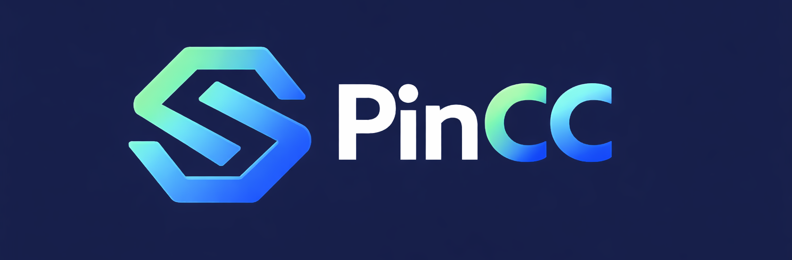
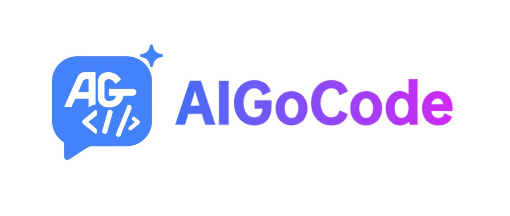

# Sub2API

<div align="center">

[](https://golang.org/)
[](https://vuejs.org/)
[](https://www.postgresql.org/)
[](https://redis.io/)
[](https://www.docker.com/)

<a href="https://trendshift.io/repositories/21823" target="_blank"></a>

**AI API Gateway Platform for Subscription Quota Distribution**

English | [中文](README_CN.md) | [日本語](README_JA.md)

</div>

> **Sub2API officially uses only the domains `sub2api.org` and `pincc.ai`. Other websites using the Sub2API name may be third-party deployments or services and are not affiliated with this project. Please verify and exercise your own judgment.**

---

## Demo

Try Sub2API online: **[https://demo.sub2api.org/](https://demo.sub2api.org/)**

Demo credentials (shared demo environment; **not** created automatically for self-hosted installs):

| Email | Password |
|-------|----------|
| admin@sub2api.org | admin123 |

## Overview

Sub2API is an AI API gateway platform designed to distribute and manage API quotas from AI product subscriptions. Users can access upstream AI services through platform-generated API Keys, while the platform handles authentication, billing, load balancing, and request forwarding.

## Features

- **Multi-Account Management** - Support multiple upstream account types (OAuth, API Key)
- **API Key Distribution** - Generate and manage API Keys for users
- **Precise Billing** - Token-level usage tracking and cost calculation
- **Smart Scheduling** - Intelligent account selection with sticky sessions
- **Concurrency Control** - Per-user and per-account concurrency limits
- **Rate Limiting** - Configurable request and token rate limits
- **Built-in Payment System** - Supports EasyPay, Alipay, WeChat Pay, and Stripe for user self-service top-up, no separate payment service needed ([Configuration Guide](docs/PAYMENT.md))
- **Admin Dashboard** - Web interface for monitoring and management
- **External System Integration** - Embed external systems (e.g. ticketing) via iframe to extend the admin dashboard

## ❤️ Sponsors

> [Want to appear here?](mailto:support@pincc.ai)

<table>
<tr>
<td width="180" align="center" valign="middle"><a href="https://shop.pincc.ai/"></a></td>
<td valign="middle"><b><a href="https://shop.pincc.ai/">PinCC</a></b> is the official relay service built on Sub2API, offering stable access to Claude Code, Codex, Gemini and other popular models — ready to use, no deployment or maintenance required.</td>
</tr>

<tr>
<td width="180"><a href="https://www.packyapi.com/register?aff=sub2api"></a></td>
<td>Thanks to PackyCode for sponsoring this project! PackyCode is a reliable and efficient API relay service provider, offering relay services for Claude Code, Codex, Gemini, and more. PackyCode provides special discounts for our software users: register using <a href="https://www.packyapi.com/register?aff=sub2api">this link</a> and enter the "sub2api" promo code during first recharge to get 10% off.</td>
</tr>

<tr>
<td width="180"><a href="https://poixe.com/i/sub2api"></a></td>
<td>Thanks to Poixe Ai for sponsoring this project! Poixe AI provides reliable LLM API services. You can leverage the platform's API endpoints to seamlessly build AI-powered products. Additionally, you can become a vendor by providing AI API resources to the platform and earn revenue. Register through the exclusive <a href="https://poixe.com/i/sub2api">sub2api</a> referral link and receive a bonus of $5 USD on your first top-up.</td>
</tr>

<tr>
<td width="180"><a href="https://ctok.ai"></a></td>
<td>Thanks to CTok.ai for sponsoring this project! CTok.ai is dedicated to building a one-stop AI programming tool service platform. We offer professional Claude Code packages and technical community services, with support for Google Gemini and OpenAI Codex. Through carefully designed plans and a professional tech community, we provide developers with reliable service guarantees and continuous technical support, making AI-assisted programming a true productivity tool. Click <a href="https://ctok.ai">here</a> to register!</td>
</tr>

<tr>
<td width="180"><a href="https://code.silkapi.com/register?aff=SUB2API"></a></td>
<td>Thanks to SilkAPI for sponsoring this project! <a href="https://code.silkapi.com/register?aff=SUB2API">SilkAPI</a> is a relay service built on Sub2API, specializing in providing high-speed and stable Codex API relay.</td>
</tr>

<tr>
<td width="180"><a href="https://ylscode.com/"></a></td>
<td>Thanks to YLS Code for sponsoring this project! <a href="https://ylscode.com/">YLS Code</a> is dedicated to building secure enterprise-grade Coding Agent productivity services, offering stable and fast Codex / Claude / Gemini subscription services along with pay-as-you-go API options for flexible choices. Register now for a limited-time 3-day Codex trial bonus!</td>
</tr>

<tr>
<td width="180"><a href="https://www.aicodemirror.com/register?invitecode=KMVZQM"></a></td>
<td>Thanks to AICodeMirror for sponsoring this project! AICodeMirror provides official high-stability relay services for Claude Code / Codex / Gemini CLI, with enterprise-grade concurrency, fast invoicing, and 24/7 dedicated technical support. Claude Code / Codex / Gemini official channels at 38% / 2% / 9% of original price, with extra discounts on top-ups! AICodeMirror offers special benefits for sub2api users: register via <a href="https://www.aicodemirror.com/register?invitecode=KMVZQM">this link</a> to enjoy 20% off your first top-up, and enterprise customers can get up to 25% off!</td>
</tr>

<tr>
<td width="180"><a href="https://aigocode.com/invite/SUB2API"></a></td>
<td>Thanks to AIGoCode for sponsoring this project! AIGoCode is an all-in-one platform that integrates Claude Code, Codex, and the latest Gemini models, providing you with stable, efficient, and highly cost-effective AI coding services. The platform offers flexible subscription plans, zero risk of account suspension, direct access with no VPN required, and lightning-fast responses. AIGoCode has prepared a special benefit for sub2api users: if you register via <a href="https://aigocode.com/invite/SUB2API">this link</a>, you'll receive an extra 10% bonus credit on your first top-up!</td>
</tr>

<tr>
<td width="180"><a href="https://shop.bmoplus.com/?utm_source=github"></a></td>
<td>Huge thanks to BmoPlus for sponsoring this project! BmoPlus is a highly reliable AI account provider built strictly for heavy AI users and developers. They offer rock-solid, ready-to-use accounts and official top-up services for ChatGPT Plus / ChatGPT Pro (Full Warranty) / Claude Pro / Super Grok / Gemini Pro. By registering and ordering through <a href="https://shop.bmoplus.com/?utm_source=github">BmoPlus - Premium AI Accounts & Top-ups</a>, users can unlock the mind-blowing rate of 10% of the official GPT subscription price (90% OFF)</td>
</tr>

<tr>
<td width="180"><a href="https://bestproxy.com/?keyword=a2e8iuol"></a></td>
<td>Thanks to Bestproxy for sponsoring this project! <a href="https://bestproxy.com/?keyword=a2e8iuol">Bestproxy</a> provides high-purity residential IPs with dedicated one-IP-per-account support. By combining real home networks with fingerprint isolation, it enables link environment isolation and reduces the probability of association-based risk control.</td>
</tr>

<tr>
<td width="180"><a href="https://pateway.ai/?ch=1tsfr51"></a></td>
<td>Thanks to PatewayAI for sponsoring this project! PatewayAI is a premium model API relay service provider built for heavy AI developers, focused on direct official connections. Offering the full Claude series and Codex series models, 100% sourced directly from official providers — no dilution, no substitution, open to verification. Billing is fully transparent with token-level invoices that can be audited line by line.
Enterprise-grade high concurrency is also supported, with a dedicated management platform for enterprise clients. Enterprise customers can sign formal contracts and receive invoices. Visit the official website for more details and contact information.
Register now via <a href="https://pateway.ai/?ch=1tsfr51">this link</a> to receive $3 in trial credits. User top-ups start as low as 60% off, and referring friends earns both parties rewards — referral bonuses up to $150.</td>
</tr>

</table>

## Ecosystem

Community projects that extend or integrate with Sub2API:

| Project | Description | Features |
|---------|-------------|----------|
| ~~[Sub2ApiPay](https://github.com/touwaeriol/sub2apipay)~~ | ~~Self-service payment system~~ | **Now Built-in** — Payment is now integrated into Sub2API, no separate deployment needed. See [Payment Configuration Guide](docs/PAYMENT.md) |
| [sub2api-mobile](https://github.com/ckken/sub2api-mobile) | Mobile admin console | Cross-platform app (iOS/Android/Web) for user management, account management, monitoring dashboard, and multi-backend switching; built with Expo + React Native |

## Tech Stack

| Component | Technology |
|-----------|------------|
| Backend | Go 1.26.3, Gin, Ent |
| Frontend | Vue 3.4+, Vite 5+, TailwindCSS |
| Database | PostgreSQL 15+ |
| Cache/Queue | Redis 7+ |

## Documentation

- Docs index: [docs/README.md](docs/README.md)
- Developer guide: [DEV_GUIDE.md](DEV_GUIDE.md)
- Changelog: [CHANGELOG.md](CHANGELOG.md)

---

## Nginx Reverse Proxy Note

When using Nginx as a reverse proxy for Sub2API (or CRS) with Codex CLI, add the following to the `http` block in your Nginx configuration:

```nginx
underscores_in_headers on;
```

Nginx drops headers containing underscores by default (e.g. `session_id`), which breaks sticky session routing in multi-account setups.

---

## Deployment

### Method 1: Verified Binary Install (Recommended)

Download a fixed release bundle, verify it, then run the bundled installer locally.

#### Prerequisites

- Linux server (`amd64` or `arm64`)
- PostgreSQL 15+ (installed and running)
- Redis 7+ (installed and running)
- `curl`, `tar`, and `sha256sum` (or `shasum`)
- Root privileges

#### Installation Steps

```bash
VERSION=vX.Y.Z
ARCH=amd64   # or arm64
ARCHIVE="sub2api_${VERSION#v}_linux_${ARCH}.tar.gz"

curl -fsSLO "https://github.com/Wei-Shaw/sub2api/releases/download/${VERSION}/${ARCHIVE}"
curl -fsSLO "https://github.com/Wei-Shaw/sub2api/releases/download/${VERSION}/checksums.txt"
grep " ${ARCHIVE}$" checksums.txt > "${ARCHIVE}.sha256"
test -s "${ARCHIVE}.sha256"
sha256sum -c "${ARCHIVE}.sha256"
tar -xzf "${ARCHIVE}"
sudo ./deploy/install.sh
```

The installer:
1. Installs the binary to `/opt/sub2api`
2. Writes server defaults to `/etc/sub2api/sub2api.env` with mode `0600`
3. Creates a hardened systemd unit
4. Keeps the default bind address on `127.0.0.1` so you can publish via Caddy/Nginx/TLS

#### Post-Installation

```bash
# Start the service
sudo systemctl start sub2api

# Enable auto-start on boot
sudo systemctl enable sub2api

# View logs
sudo journalctl -u sub2api -f
```

The Setup Wizard still guides you through:
- Database configuration
- Redis configuration
- Admin account creation

#### Upgrade

You can still upgrade from the **Admin Dashboard**, or install a verified bundle for a specific version and re-run:

```bash
sudo ./deploy/install.sh upgrade -v vX.Y.Z
```

#### Useful Commands

```bash
# Check status
sudo systemctl status sub2api

# Restart service
sudo systemctl restart sub2api

# Uninstall (installer is copied into /opt/sub2api during setup)
sudo /opt/sub2api/install.sh uninstall -y
```

---

### Method 2: Docker Compose (Recommended)

Deploy with Docker Compose, including PostgreSQL and Redis containers, while keeping secrets in a `0600` env file and keeping database/cache data out of release bundles.

#### Prerequisites

- Docker 20.10+
- Docker Compose v2+
- `curl`, `tar`, and `sha256sum` (or `shasum`)

#### Quick Start (Pinned Release Bundle)

```bash
VERSION=vX.Y.Z
ARCH=amd64   # or arm64
ARCHIVE="sub2api_${VERSION#v}_linux_${ARCH}.tar.gz"

curl -fsSLO "https://github.com/Wei-Shaw/sub2api/releases/download/${VERSION}/${ARCHIVE}"
curl -fsSLO "https://github.com/Wei-Shaw/sub2api/releases/download/${VERSION}/checksums.txt"
grep " ${ARCHIVE}$" checksums.txt > "${ARCHIVE}.sha256"
test -s "${ARCHIVE}.sha256"
sha256sum -c "${ARCHIVE}.sha256"
tar -xzf "${ARCHIVE}"

mkdir -p sub2api-deploy
cd sub2api-deploy
bash ../deploy/docker-deploy.sh
docker compose up -d
docker compose logs -f sub2api
```

**What `docker-deploy.sh` does now:**
- Copies the bundled `docker-compose.local.yml` and `.env.example` into the current directory
- Pins `SUB2API_IMAGE_REF` to the bundle version when possible
- Generates `POSTGRES_PASSWORD`, `REDIS_PASSWORD`, `ADMIN_PASSWORD`, `JWT_SECRET`, and `TOTP_ENCRYPTION_KEY`
- Writes them only to `.env` with mode `0600`
- Creates only `./data`; PostgreSQL and Redis use named volumes

#### Manual Deployment

If you prefer manual setup:

```bash
git clone https://github.com/Wei-Shaw/sub2api.git
cd sub2api/deploy
cp .env.example .env
chmod 600 .env
nano .env
mkdir -p data
docker compose -f docker-compose.local.yml up -d
```

**Required configuration in `.env`:**

```bash
SUB2API_IMAGE_REF=weishaw/sub2api:vX.Y.Z
POSTGRES_PASSWORD=your_secure_postgres_password
REDIS_PASSWORD=your_secure_redis_password
ADMIN_EMAIL=admin@example.com
ADMIN_PASSWORD=your_secure_admin_password
JWT_SECRET=your_jwt_secret_here
TOTP_ENCRYPTION_KEY=your_totp_key_here
BIND_HOST=127.0.0.1
SERVER_PORT=8080
```

#### Deployment Variants

| Version | Data Storage | Migration Posture | Best For |
|---------|-------------|-------------------|----------|
| **docker-compose.local.yml** | `./data` + named PostgreSQL/Redis volumes | Archive only allowlisted files; export DB/Redis separately | Production, repeatable upgrades |
| **docker-compose.yml** | Named volumes for app + DB + Redis | Docker-managed volume workflow | Simple all-in-one setup |

**Recommendation:** Use `docker-compose.local.yml` for production. It keeps the editable app config/logs local while preventing `postgres_data` / `redis_data` from landing in release or migration bundles.

#### Access

The default bind address is `127.0.0.1`, so publish it through Caddy/Nginx/TLS before exposing it publicly. For local checks:

```bash
curl http://127.0.0.1:8080/health
```

#### Upgrade

1. Edit `.env` and bump `SUB2API_IMAGE_REF` to the new pinned tag or digest.
2. Recreate the containers:

```bash
docker compose -f docker-compose.local.yml pull
docker compose -f docker-compose.local.yml up -d
```

#### Migration Notes

Do **not** tar the whole deployment tree together with runtime state anymore. Archive only control-plane files such as:

- `.env`
- `docker-compose.yml` / `docker-compose.local.yml`
- `data/`

Then export PostgreSQL and Redis separately using your normal backup tooling (for example `pg_dump` and an RDB/AOF snapshot) before restoring them on the target host.

#### Useful Commands

```bash
# Stop all services
docker compose -f docker-compose.local.yml down

# Restart
docker compose -f docker-compose.local.yml restart

# View all logs
docker compose -f docker-compose.local.yml logs -f

# Inspect named volumes before any backup or cleanup
docker volume ls | grep sub2api
```

---

### Method 3: Build from Source

Build and run from source code for development or customization.

#### Prerequisites

- Go 1.26.3
- Node.js 18+
- PostgreSQL 15+
- Redis 7+

#### Build Steps

```bash
# 1. Clone the repository
git clone https://github.com/Wei-Shaw/sub2api.git
cd sub2api

# 2. Install pnpm (if not already installed)
npm install -g pnpm

# 3. Build frontend
cd frontend
pnpm install
pnpm run build
# Output will be in ../backend/internal/web/dist/

# 4. Build backend with embedded frontend
cd ../backend
go build -tags embed -o sub2api ./cmd/server

# 5. Create configuration file
cp ../deploy/config.example.yaml ./config.yaml

# 6. Edit configuration
nano config.yaml
```

> **Note:** The `-tags embed` flag embeds the frontend into the binary. Without this flag, the binary will not serve the frontend UI.

**Key configuration in `config.yaml`:**

```yaml
server:
  host: "127.0.0.1"
  port: 8080
  mode: "release"

database:
  host: "localhost"
  port: 5432
  user: "postgres"
  password: "your_password"
  dbname: "sub2api"

redis:
  host: "localhost"
  port: 6379
  password: ""

jwt:
  secret: "change-this-to-a-secure-random-string"
  expire_hour: 24

default:
  user_concurrency: 5
  user_balance: 0
  api_key_prefix: "sk-"
  rate_multiplier: 1.0
```

### Sora Status (Temporarily Unavailable)

> ⚠️ Sora-related features are temporarily unavailable due to technical issues in upstream integration and media delivery.
> Please do not rely on Sora in production at this time.
> Existing `gateway.sora_*` configuration keys are reserved and may not take effect until these issues are resolved.

Additional security-related options are available in `config.yaml`:

- `cors.allowed_origins` for CORS allowlist
- `security.url_allowlist` for upstream/pricing/CRS host allowlists
- `security.url_allowlist.enabled` to disable URL validation (use with caution)
- `security.url_allowlist.allow_insecure_http` to allow HTTP URLs when validation is disabled
- `security.url_allowlist.allow_private_hosts` to allow private/local IP addresses
- `security.response_headers.enabled` to enable configurable response header filtering (disabled uses default allowlist)
- `security.csp` to control Content-Security-Policy headers
- `billing.circuit_breaker` to fail closed on billing errors
- `server.trusted_proxies` to enable X-Forwarded-For parsing
- `turnstile.required` to require Turnstile in release mode

**⚠️ Security Warning: HTTP URL Configuration**

When `security.url_allowlist.enabled=false`, the system performs minimal URL validation by default, **rejecting HTTP URLs** and only allowing HTTPS. To allow HTTP URLs (e.g., for development or internal testing), you must explicitly set:

```yaml
security:
  url_allowlist:
    enabled: false                # Disable allowlist checks
    allow_insecure_http: true     # Allow HTTP URLs (⚠️ INSECURE)
```

**Or via environment variable:**

```bash
SECURITY_URL_ALLOWLIST_ENABLED=false
SECURITY_URL_ALLOWLIST_ALLOW_INSECURE_HTTP=true
```

**Risks of allowing HTTP:**
- API keys and data transmitted in **plaintext** (vulnerable to interception)
- Susceptible to **man-in-the-middle (MITM) attacks**
- **NOT suitable for production** environments

**When to use HTTP:**
- ✅ Development/testing with local servers (http://localhost)
- ✅ Internal networks with trusted endpoints
- ✅ Testing account connectivity before obtaining HTTPS
- ❌ Production environments (use HTTPS only)

**Example error without this setting:**
```
Invalid base URL: invalid url scheme: http
```

If you disable URL validation or response header filtering, harden your network layer:
- Enforce an egress allowlist for upstream domains/IPs
- Block private/loopback/link-local ranges
- Enforce TLS-only outbound traffic
- Strip sensitive upstream response headers at the proxy

```bash
# 6. Run the application
./sub2api
```

#### Development Mode

```bash
# Backend (with hot reload)
cd backend
go run ./cmd/server

# Frontend (with hot reload)
cd frontend
pnpm run dev
```

#### Code Generation

When editing `backend/ent/schema`, regenerate Ent + Wire:

```bash
cd backend
go generate ./ent
go generate ./cmd/server
```

---

## Simple Mode

Simple Mode is designed for individual developers or internal teams who want quick access without full SaaS features.

- Enable: Set environment variable `RUN_MODE=simple`
- Difference: Hides SaaS-related features and skips billing process
- Security note: In production, you must also set `SIMPLE_MODE_CONFIRM=true` to allow startup

---

## Antigravity Support

Sub2API supports [Antigravity](https://antigravity.so/) accounts. After authorization, dedicated endpoints are available for Claude and Gemini models.

### Dedicated Endpoints

| Endpoint | Model |
|----------|-------|
| `/antigravity/v1/messages` | Claude models |
| `/antigravity/v1beta/` | Gemini models |

### Claude Code Configuration

```bash
export ANTHROPIC_BASE_URL="http://localhost:8080/antigravity"
export ANTHROPIC_AUTH_TOKEN="sk-xxx"
```

### Hybrid Scheduling Mode

Antigravity accounts support optional **hybrid scheduling**. When enabled, the general endpoints `/v1/messages` and `/v1beta/` will also route requests to Antigravity accounts.

> **⚠️ Warning**: Anthropic Claude and Antigravity Claude **cannot be mixed within the same conversation context**. Use groups to isolate them properly.

### Known Issues

In Claude Code, Plan Mode cannot exit automatically. (Normally when using the native Claude API, after planning is complete, Claude Code will pop up options for users to approve or reject the plan.)

**Workaround**: Press `Shift + Tab` to manually exit Plan Mode, then type your response to approve or reject the plan.

---

## Project Structure

```
sub2api/
├── backend/                  # Go backend service
│   ├── cmd/server/           # Application entry
│   ├── internal/             # Internal modules
│   │   ├── config/           # Configuration
│   │   ├── model/            # Data models
│   │   ├── service/          # Business logic
│   │   ├── handler/          # HTTP handlers
│   │   └── gateway/          # API gateway core
│   └── resources/            # Static resources
│
├── frontend/                 # Vue 3 frontend
│   └── src/
│       ├── api/              # API calls
│       ├── stores/           # State management
│       ├── views/            # Page components
│       └── components/       # Reusable components
│
└── deploy/                   # Deployment files
    ├── docker-compose.yml    # Docker Compose configuration
    ├── .env.example          # Environment variables for Docker Compose
    ├── config.example.yaml   # Full config file for binary deployment
    └── install.sh            # One-click installation script
```

## Disclaimer

> **Please read carefully before using this project:**
>
> :rotating_light: **Terms of Service Risk**: Using this project may violate Anthropic's Terms of Service. Please read Anthropic's user agreement carefully before use. All risks arising from the use of this project are borne solely by the user.
>
> :book: **Disclaimer**: This project is for technical learning and research purposes only. The author assumes no responsibility for account suspension, service interruption, or any other losses caused by the use of this project.

---

## Star History

<a href="https://star-history.com/#Wei-Shaw/sub2api&Date">
 <picture>
   <source media="(prefers-color-scheme: dark)" srcset="https://api.star-history.com/svg?repos=Wei-Shaw/sub2api&type=Date&theme=dark" />
   <source media="(prefers-color-scheme: light)" srcset="https://api.star-history.com/svg?repos=Wei-Shaw/sub2api&type=Date" />
   
 </picture>
</a>

---

## License

This project is licensed under the [GNU Lesser General Public License v3.0](LICENSE) (or later).

Copyright (c) 2026 Wesley Liddick

---

<div align="center">

**If you find this project useful, please give it a star!**

</div>
